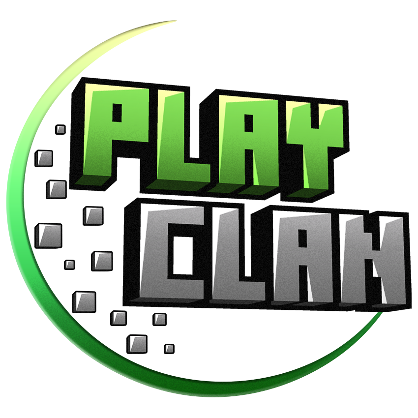

<p align="center"></p>

<h1 align="center">PlayClan Launcher</h1>

<em><h5 align="center">(A [Helios Launcher][fork]-ből forkolva)</h5></em>


<p align="center">Csatlakozz a PlayClan szerverére pár kattintással!</p>


<div align="center"> </p></div>


## Funkciók

* 🔒 Teljes fiók kezelés.
  * Több fiók hozzáadása és váltás egy kattintással a fiókok között.
  * Microsoft bejelentkezés, eredeti fiókok számára.
    * A bejelentkezési adatokat nem tároljuk, egyből továbbítjuk a Microsoftnak/Mojangnak.
  * PlayClan fiók bejelentkezés.
    * Automatikus bejelentkezés a szerverre.
    * Automatikus IP levédés amennyiben van beállítva a fiókodon.
    * Shop megnyitása egy kattintással
* 📂 Hatékony fájl kezelés.
  * Automatikusan megkapod a kliens frissítéseket, amikor kiadjuk azokat.
  * A fájlok ellenőrizve vannak indítás előtt. A hibás fájlokat újra letöltjük.
* ☕ **Automatikus Java ellenőrzés.**
  * Ha nem kompatibilis Java verzió van telepítve, akkor automatikus letöltjük a megfelelő verziót *neked*.
  * Nem kell Java-t telepítened a kliens futtatásához.
* 📰 A Kortdex hírek csatorna natívan bele van építve a kliensbe.
* ⚙️ Intuitív beállítások kezelés, beleértve a Java beállítások módosítását.
* 📝 Több Minecraft verzió.
  * Válassz másik Minecraft verziót egy kattintással.
* 🖥️ Automatikus kliens frissítések. A háttérben frissül a kliens.
* 🌍 PlayClan szerverek státuszainak megtekintése.
* 🌐 Választható alkalmazás nyelv
  * Magyar
  * Angol 

De ez még nem minden! Töltsd le és telepítsd a kliensünket, hogy felfedezd, mit kínál még!

#### Segítségre van szükséged? [Csatlakozz Discord szerverünkre](https://dc.playclan.net)

## Letöltés

A klienst letudod tölteni [innen](https://github.com/PlayClan/PCLauncher/releases).

**Támogatott platformok**

| Platform | Fájl |
| -------- | ---- |
| Windows x64 | `PlayClan-Launcher-setup-VERZIÓ.exe` |
| macOS x64 | `PlayClan-Launcher-setup-VERZIÓ-x64.dmg` |
| macOS arm64 | `PlayClan-Launcher-setup-VERZIÓ-arm64.dmg` |
| Linux x64 | `PlayClan-Launcher-VERZIÓ-x86_64.AppImage` |
| Linux arm64 | `PlayClan-Launcher-VERZIÓ-arm64.AppImage` |

## Konzol

Ahhoz, hogy megnyisd a konzolt, a következő billentyű kombinációt kell lenyomnod:

```console
Ctrl + Shift + i
```

Győződj meg róla, hogy a Console oldalon vagy. Ne másolj be semmit a konzolba, ha mástól kaptál valamilyen kódot, csak akkor ha 100%-ban biztos vagy abban, hogy mit csinál a kód. **Ismeretlen kódok bemásolásával a fiókodat teszed kockára.**

#### Konzol kiexportálása


Ha ki akarod exportálni a Konzolod tartalmát, csak kattints jobb klikkel bárhová és válaszd a **Save as..** menüpontot.


## Fejlesztés

Amennyiben szeretnéd bővíteni a Launcher-t, vagy csak saját magadnak szeretnéd ki buildelni az alkalmazást.

### Hozzákezdés

**Rendszerkövetelmények**

* [Node.js][nodejs] v22

---

**Repó klónozása és szükséges kiegészítők telepítése**

```console
> git clone https://github.com/PlayClan/PCLauncher.git
> cd PCLauncher
> npm install
```

---

**Launcher elindítása**

```console
> npm start
```

---

**Telepítő készítése**

A  te által használt platformodra való buildelés

```console
> npm run dist
```

Telepítő készítése más platformokra

| Platform    | Parancs              |
| ----------- | -------------------- |
| Windows x64 | `npm run dist:win`   |
| macOS       | `npm run dist:mac`   |
| Linux       | `npm run dist:linux` |

MacOS-re való buildelés nem minden esetben működhet Windows/Linux rendszereken.

---

### Visual Studio Code

A Launcher fejlesztését a [Visual Studio Code][vscode] segítségével ajánlott elvégezni.

Másold be az alábbi kódot a `.vscode/launch.json` fájlba

```JSON
{
  "version": "0.2.0",
  "configurations": [
    {
      "name": "Debug Main Process",
      "type": "node",
      "request": "launch",
      "cwd": "${workspaceFolder}",
      "program": "${workspaceFolder}/node_modules/electron/cli.js",
      "args" : ["."],
      "outputCapture": "std"
    },
    {
      "name": "Debug Renderer Process",
      "type": "chrome",
      "request": "launch",
      "runtimeExecutable": "${workspaceFolder}/node_modules/.bin/electron",
      "windows": {
        "runtimeExecutable": "${workspaceFolder}/node_modules/.bin/electron.cmd"
      },
      "runtimeArgs": [
        "${workspaceFolder}/.",
        "--remote-debugging-port=9222"
      ],
      "webRoot": "${workspaceFolder}"
    }
  ]
}
```

Ez két debug konfigurációt hoz létre.

#### Főfolyamat debugolása (alapértelmezett)

Ez lehetővé teszi az Electron [főfolyamatának][mainprocess] debugolását. A DevTools ablak megnyitásával a [renderelő folyamat][rendererprocess] parancsfájlok debugolását végezheted el.

#### Renderelő folyamat debugolása

Ez lehetővé teszi az Electron [renderelő folyamat][rendererprocess] debugolását. Ehhez telepítenie kell a [Debugger for Chrome][chromedebugger] bővítményt.

Vedd figyelembe, hogy **nem** nyithatsz meg DevTools ablakot, miközben ezt a debug konfigurációt használod. A Chromium csak egy debugolót engedélyez, egy másik megnyitása után összeomlik a program.

---

### Megjegyzés a harmadik fél általi használathoz

Kérjük, nevezze meg az eredeti készítőt, és adjon meg egy linket az eredeti forráshoz. Ez egy ingyenes szoftver, kérjük, legalább ennyit tegyen meg. <small>*(Az [eredeti készítő][fork] kérése)*</small>

A Microsoft Authentication beállításához lásd: https://github.com/PlayClan/PCLauncher/blob/master/docs/MicrosoftAuth.md.

---

## Források

* [Helios Launcher][fork]
* [Helios Launcher Wiki][wiki]
* [Nebula (Distribution.json fájl készítése)][nebula]

Ha bármiben elkadtál, csatlakozz Discord szerverünkre, ahol segíthetünk.

[][discord]

---

### Találkozunk a szerveren.

[nodejs]: https://nodejs.org/en/ 'Node.js'
[vscode]: https://code.visualstudio.com/ 'Visual Studio Code'
[mainprocess]: https://electronjs.org/docs/tutorial/application-architecture#main-and-renderer-processes 'Main Process'
[rendererprocess]: https://electronjs.org/docs/tutorial/application-architecture#main-and-renderer-processes 'Renderer Process'
[chromedebugger]: https://marketplace.visualstudio.com/items?itemName=msjsdiag.debugger-for-chrome 'Debugger for Chrome'
[discord]: https://dc.playclan.net 'Discord'
[wiki]: https://github.com/dscalzi/HeliosLauncher/wiki 'wiki'
[fork]: https://github.com/dscalzi/HeliosLauncher 'fork'
[nebula]: https://github.com/dscalzi/Nebula 'dscalzi/Nebula'
